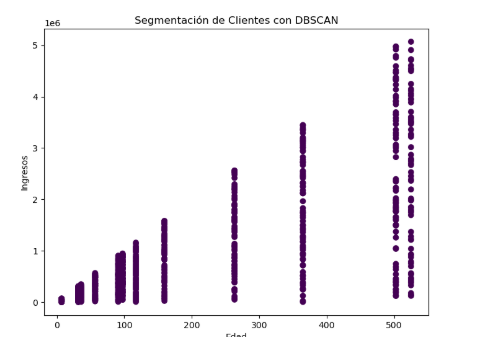
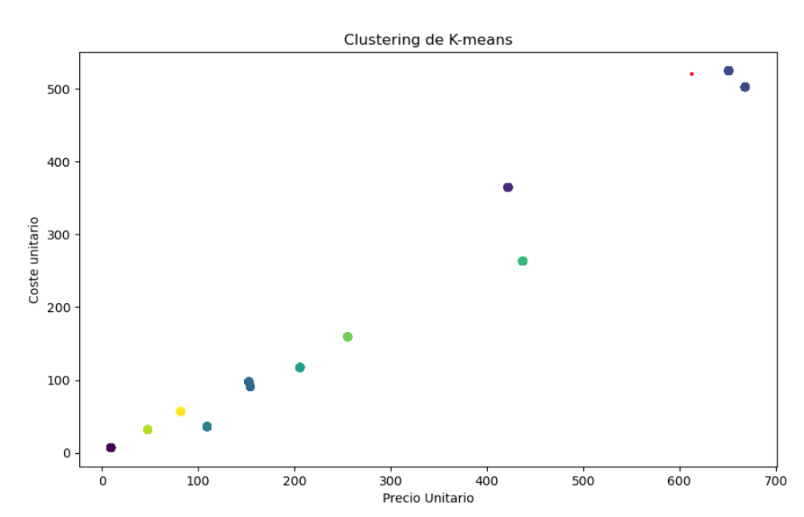

# 😁 Clustering 1 🏢

## Caso 1:



```python
# El código siguiente, que crea un dataframe y quita las filas duplicadas, siempre se ejecuta y actúa como un preámbulo del script: 

# dataset = pandas.DataFrame(Coste unitario, Importe Coste total, Importe venta total, Precio Unitario, Unidades)
# dataset = dataset.drop_duplicates()

# Pegue o escriba aquí el código de script:
import pandas as pd
import matplotlib.pyplot as plt
from sklearn.cluster import DBSCAN

dataset = dataset

dataset = dataset[['Coste unitario', 'Importe Coste total']]

#crear y ajustar el modelo de KMeans
dbscan = DBSCAN(eps=0.2, min_samples=5)
dataset['Unidades'] = dbscan.fit_predict(dataset)

plt.figure(figsize=(8,6))
plt.scatter(dataset['Coste unitario'], dataset['Importe Coste total'], c=dataset['Unidades'], cmap='viridis')
plt.title('Segmentación de Clientes con DBSCAN')
plt.xlabel('Edad')
plt.ylabel('Ingresos')
plt.show()
```

## Caso 2:



```python
# El código siguiente, que crea un dataframe y quita las filas duplicadas, siempre se ejecuta y actúa como un preámbulo del script: 

# dataset = pandas.DataFrame(Unidades, Coste unitario, Precio Unitario, Importe Coste total, Importe venta total)
# dataset = dataset.drop_duplicates()

# Pegue o escriba aquí el código de script:
import numpy as np
import pandas as pd
import matplotlib.pyplot as plt
from sklearn.cluster import KMeans

dataset = dataset
x= dataset[['Precio Unitario','Coste unitario']]

kmeans= KMeans(n_clusters=10, random_state=42)
dataset['Unidades']=kmeans.fit_predict(x)

plt.figure(figsize=(10,6))
plt.scatter(dataset['Precio Unitario'], dataset['Coste unitario'],c=dataset['Unidades'],cmap='viridis')
plt.title('Clustering de K-means')
plt.xlabel('Precio Unitario')
plt.ylabel('Coste unitario')
plt.show()

```
