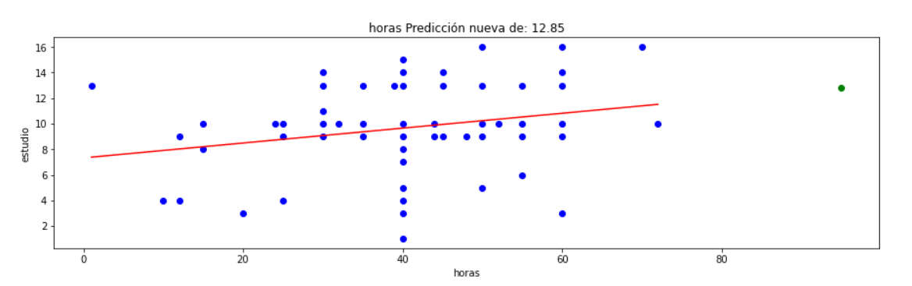

# 🦎Regresión Lineal 2🍉



```python
# El código siguiente, que crea un dataframe y quita las filas duplicadas, siempre se ejecuta y actúa como un preámbulo del script: 

# dataset = pandas.DataFrame(horas, estudio)
# dataset = dataset.drop_duplicates()

# Pegue o escriba aquí el código de script:import numpy as np
import pandas as pd
from sklearn.neighbors import KNeighborsClassifier
import matplotlib.pyplot as plt
from sklearn.linear_model import LinearRegression

#Declarar el modelo indicando que vamos a utilizar regresión lineal 
model = LinearRegression()


# Ajustar el modelo con 'horas' como predictor e 'estudio' como la variable objetivo
model.fit(dataset[['horas']], dataset['estudio'])

# Hacer predicciones utilizando 'horas', es decir según la cantidad conocer el importe
predicciones = model.predict(dataset[['horas']])

# Graficar los resultados
plt.scatter(dataset['horas'], dataset['estudio'], color='blue')  # Datos reales
plt.plot(dataset['horas'], predicciones, color='red')  # Línea de regresión

nuevo_importe = 95  # El valor de las horas para el cual deseas predecir
prediccion_nueva = model.predict([[nuevo_importe]])

plt.xlabel('horas')
plt.ylabel('estudio')
plt.title(f'horas Predicción nueva de: {prediccion_nueva[0]:.2f}')

# Agregar el nuevo punto al gráfico analizar
plt.scatter(nuevo_importe, prediccion_nueva, color='green', zorder=5) 

#visualizar el resultado
plt.show()
```
